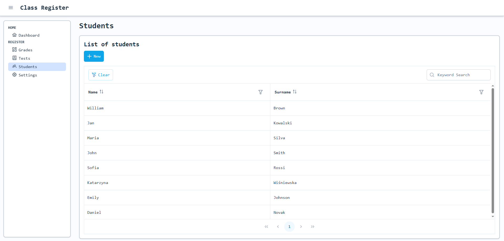
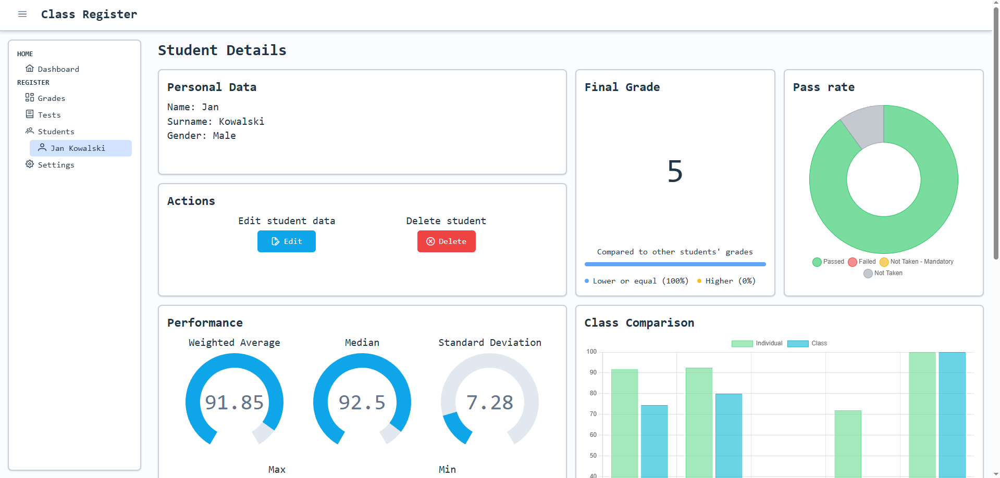
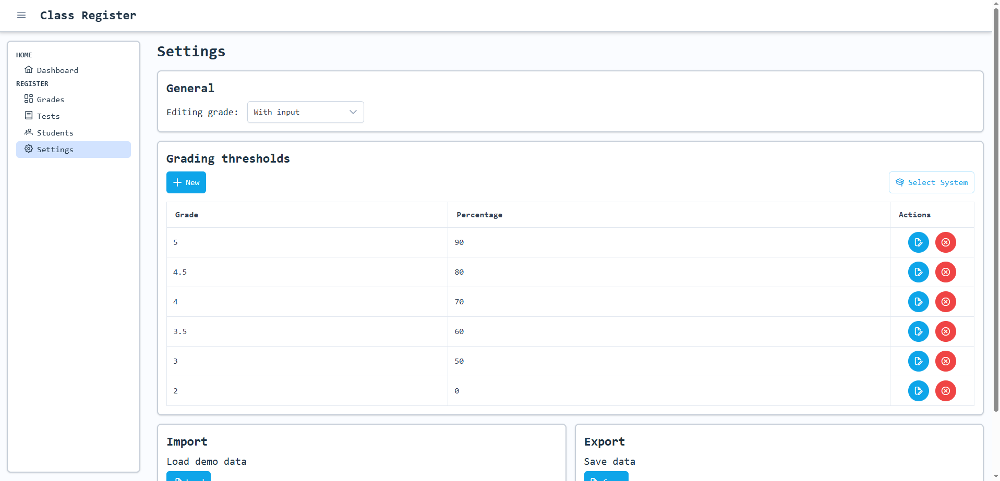

# Class Register
Class Register is a web application built with Vue.js that allows managing students' grades. It provides tools to display detailed statistics about individual students or specific tests. All data is stored locally in the browser, so the app works fully without a backend.

🌐 Access Class Register on GitHub Pages: https://robertpintera.github.io/Class-register

ℹ️ In the Settings section, you can use the “Load Demo Data” option to quickly import sample data and try out the application.

## Features

- Store data in IndexedDB
- Create and edit student and test records  
- Display statistics for individual students or tests  
- Sort and filter data in interactive tables
- Configure different ways of editing grades
- Load demo data from settings
- Light and Dark Mode
- Import and export data in `.json` format
- Generate student and test reports in PDF format

## Tech stack

- **Vue.js** - Core framework for building user interface
- **VueUse** - Collection of essential Vue Composition utilities
- **TypeScript** - Typed language that compiles to JavaScript
- **Tailwind CSS** - Utility-first CSS framework for styling and layout
- **Pinia** - State management library for Vue
- **Vue Router** - Client-side routing between pages
- **PrimeVue** - UI components library
- **Chart.js** - Rendering charts and statistics
- **Dexie.js** - Wrapper for IndexedDB, storing data in the browser
- **FileSaver.js** - Exporting data to `.json` files
- **Zod** - Schema validation for forms
- **Uuid** - Generating unique IDs for records
- **Eslint** - Static analysis tool for keeping the codebase clean and reliable
- **JsPDF** - Generating PDF documents in the browser
- **Jspdf-AutoTable** - Plugin for JsPDF to create tables easily in PDF files
- **Cypress** - End-to-end testing framework for browser-based applications and components

## Configuration

1. **Clone the repository**
```bash
git clone https://github.com/RobertPintera/Class-register
cd class-register
```
2. **Install dependencies**
```bash
npm install
```
3. **Run development server**
```bash
npm run dev
```
4. **Build for production**
```bash
npm run build
```
5. **Preview production build**
```bash
npm run preview
```

## Preview

### Home

### Dashboard

### Students list

### Student details

### Tests list

### Test details

### Settings

